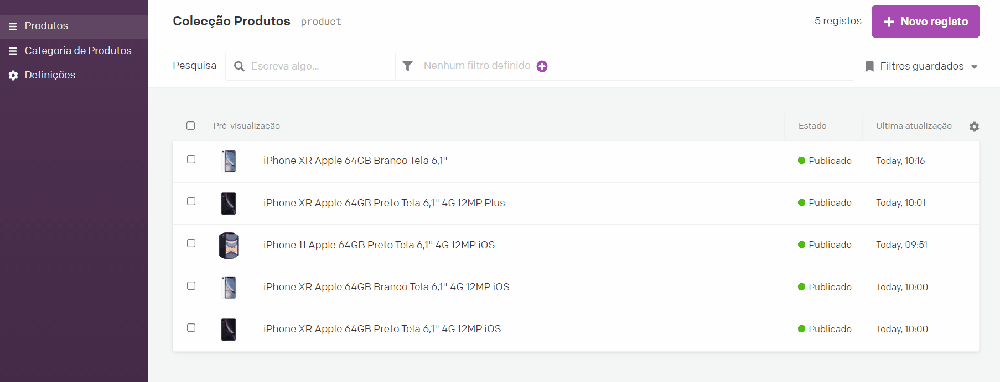

<h1 align="center">Site de Vendas por WhatsApp</h1>

O objetivo do site é demonstrar o catálogo de produtos da empresa iMall071 e coletar o pedido do usuário que será redirecionado automaticamente pelo whatsapp. O mais bacana deste site é que estou utilizando o <strong>Incremental Static Regeneration</strong> do Next.js junto com servidores cacheados da Vercel, criando páginas estáticas no momento do deploy e sendo renovada a cada 01 hora, isso faz com que o site fique um absurdo de rápido! Sério, eu nunca vi algo assim 😅. Veja você mesmo, clique no link abaixo para acompanhar em tempo real e navegue entre as páginas e produtos para verificar como é rápido. A disponibilidade de abertura do código foi autorizado pela empresa. Para o cliente gerenciar o conteúdo estou integrando o Dato CMS com GraphQL.

  <h3> 🚧 Em desenvolvimento 🚀 </h3>
  <strong><a href="https://catalogo-de-produtos-imall071.vercel.app/">🔗 Acompanhe em tempo real online - Clique Aqui</a></strong>

# Sumário
-[Funcionalidades](#funcionalidades)  
-[Imagens](#imagens) 
-[Tecnologias](#tecnologias) 
-[Autor](#autor)  

# Funcionalidades
- [x] Exibição de Produtos em destaque
- [x] Exibição de Produtos que acabaram de chegar
- [x] Carrossel de produtos no desktop e mobile
- [x] Incremental Static Regeneration Pages
- [X] Dato CMS integrado com GraphQL
- [X] Cadastro de Produtos e Categorias no Dato CMS
- [ ] Demonstração e cadastro de Serviços
- [ ] Carrinho de Produtos
- [ ] Pedido redirecionado ao WhatsApp
- [ ] Acompanhamento de Pedido

# Imagens

# Tecnologias
As ferramentas utilizadas estão sendo:
<ul style="list-style: none">
  <li>Javascript</li>
  <li>Next.Js</li>
  <li>Incremental Static Regeneration</li>
  <li>Static Paths</li>
  <li>Server Side Props</li>
  <li>Slick Slider</li>
  <li>Dato CMS</li>
  <li>GraphQL</li>
</ul>

  <h3> 🚧 Em desenvolvimento 🚀 </h3>
  <strong><a href="https://catalogo-de-produtos-imall071.vercel.app/">🔗 Acompanhe em tempo real online - Clique Aqui</a></strong>

# Autor

<a href="https://github.com/devalexsantos">Alex Santos</a>

